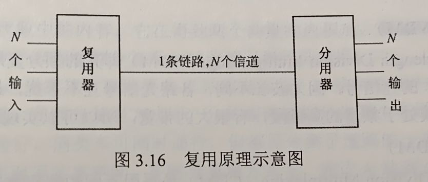
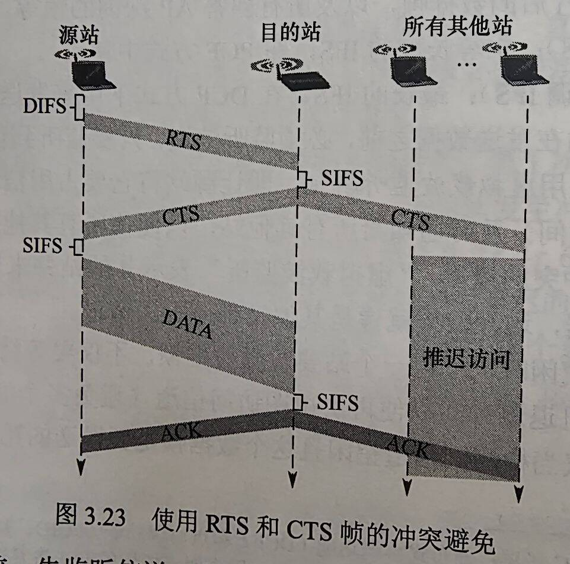
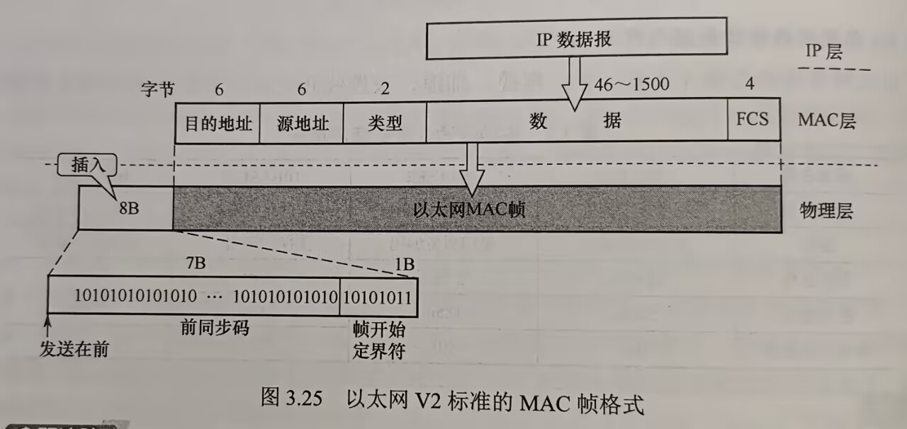

# 第三章 数据链路层

## 目录
- [第三章 数据链路层](#第三章-数据链路层)
  - [目录](#目录)
  - [3.1 数据链路层的功能](#31-数据链路层的功能)
    - [3.1.1 数据链路层所处地位](#311-数据链路层所处地位)
      - [数据链路层理解](#数据链路层理解)
      - [基本概念](#基本概念)
    - [3.1.2 链路管理](#312-链路管理)
    - [3.1.3 封装成帧与透明传输](#313-封装成帧与透明传输)
      - [封装成帧](#封装成帧)
    - [3.1.4 流量控制](#314-流量控制)
    - [3.1.5 差错检测](#315-差错检测)
    - [考点易错点](#考点易错点)
  - [3.2 组帧](#32-组帧)
    - [3.2.1 字符计数法](#321-字符计数法)
    - [3.2.2 字节填充法](#322-字节填充法)
    - [3.2.3 零比特填充法（HDLC）](#323-零比特填充法hdlc)
    - [3.2.4 违规编码法](#324-违规编码法)
    - [总结](#总结)
    - [考点\&易错点](#考点易错点-1)
  - [3.3 差错控制](#33-差错控制)
    - [3.3.1 检错编码](#331-检错编码)
      - [奇偶校验码](#奇偶校验码)
      - [循环冗余码](#循环冗余码)
    - [3.3.2 纠错编码](#332-纠错编码)
      - [码距](#码距)
      - [海明码编码过程](#海明码编码过程)
    - [考点\&易错点](#考点易错点-2)
  - [3.4 流量控制与可靠传输机制](#34-流量控制与可靠传输机制)
    - [3.4.1 流量控制与滑动窗口机制](#341-流量控制与滑动窗口机制)
      - [数据链路层与传输层流量控制区别](#数据链路层与传输层流量控制区别)
      - [停止-等待流量控制基本原理](#停止-等待流量控制基本原理)
      - [滑动窗口流量控制基本原理](#滑动窗口流量控制基本原理)
    - [3.4.2 可靠传输机制](#342-可靠传输机制)
      - [单帧滑动窗口与停止-等待协议（S-W）](#单帧滑动窗口与停止-等待协议s-w)
      - [多帧滑动窗口与后退N帧协议（GBN）](#多帧滑动窗口与后退n帧协议gbn)
      - [多帧滑动窗口与选择重传协议（SR）](#多帧滑动窗口与选择重传协议sr)
      - [信道利用率的分析](#信道利用率的分析)
    - [考点\&易错点整理](#考点易错点整理)
  - [3.5 介质访问控制](#35-介质访问控制)
    - [3.5.1 信道划分介质访问控制](#351-信道划分介质访问控制)
      - [时分复用（TDM）](#时分复用tdm)
      - [频分复用（FDM）](#频分复用fdm)
      - [波分复用（WDM）](#波分复用wdm)
      - [码分复用（CDM）](#码分复用cdm)
    - [3.5.2 随机访问介质控制](#352-随机访问介质控制)
      - [ALOHA协议](#aloha协议)
      - [CSMA协议](#csma协议)
      - [CSMA/CD](#csmacd)
      - [CSMA/CA协议](#csmaca协议)
        - [基本概念](#基本概念-1)
        - [归纳](#归纳)
        - [处理隐蔽站问题（RTS/CTS）](#处理隐蔽站问题rtscts)
        - [CSMA/CA与CSMA/CD的区别](#csmaca与csmacd的区别)
    - [3.5.3 轮询访问：令牌传递协议](#353-轮询访问令牌传递协议)
      - [传递过程](#传递过程)
      - [优点](#优点)
    - [考点\&易错点整理](#考点易错点整理-1)
  - [3.6 局域网](#36-局域网)
    - [3.6.1 局域网基本概念和体系结构](#361-局域网基本概念和体系结构)
    - [3.6.2 以太网与IEEE802.3](#362-以太网与ieee8023)
      - [以太网传输介质与网卡](#以太网传输介质与网卡)
      - [以太网的MAC地址](#以太网的mac地址)
      - [以太网MAC帧](#以太网mac帧)
      - [高速以太网](#高速以太网)
    - [3.6.3 IEEE802.11无线局域网](#363-ieee80211无线局域网)
      - [无线局域网的组成](#无线局域网的组成)
      - [802.11局域网的MAC帧](#80211局域网的mac帧)
    - [3.6.4 VLAN基本概念与原理](#364-vlan基本概念与原理)
    - [考点\&易错点](#考点易错点-3)

## 3.1 数据链路层的功能
- 三个基本问题
  - 封装成帧（组帧）
  - 透明传输
  - 差错检测
- 数据链路层使用的信道
  - 点对点信道，一对一的通信方式
    - PPP目前使用最广泛的点对点协议
  - 广播信道，这种信道上连接的主机很多，使用一对多广播通信方式
    - 有限局域网CSMA/CD协议
    - 无线局域网CSMA/CA协议

### 3.1.1 数据链路层所处地位

#### 数据链路层理解
考虑 主机H1 --局域网1-> 路由器R1 --广域网-> 路由器R2 --局域网2-> 主机H2
- 学习数据链路层时，通常只关系协议栈中 **水平方向的各数据链路层**
- 可通过如下链路 H1链路层 -> R1链路层 -> R2链路层 -> H2链路层
  - 这三段不同的数据链路可能采用**不同**的数据链路层协议

#### 基本概念
- 链路：指一个节点到**相邻节点**的一段物理线路
  - 两台计算机之间的通信路径往往经过许多段链路 —— 链路只是一条路径的组成部分
  - 链路 又称 物理链路
- 数据链路：
  - 在链路上传送数据时，除了需要链路本身，还需要**必要的通信协议**来控制这些数据的传输
  - 把实现这些协议的硬件和软件加到链路上，构成了数据链路
  - 数据链路 又称 逻辑链路
- 帧
  - 数据链路层对等实体之间进行逻辑通信的协议数据单元
    - 数据链路层把网络层下交的数据构成 帧 发送到链路
    - 接收到的 帧 中的数据取出交给网络层

### 3.1.2 链路管理
- 链路管理：数据链路层连接的 建立、维持和释放过程
  - 主要用于面向连接的服务
- 链路两端的节点要进行通信
  - 首先确认对方已处于就绪状态
  - 交换必要信息以对帧序号初始化，才能建立连接
  - 传输过程中要维持连接，而在传输完毕后释放该连接

### 3.1.3 封装成帧与透明传输

#### 封装成帧
- 指在一段数据前后分别添加首部和尾部，构成**帧**
  - 帧是数据链路层的传送单元
- **帧长**：数据部分长度加上首部尾部长度
- 帧定界：首部尾部有很多控制信息，重要作用是确定帧的界限
  - 接收方能从接收到的二进制比特流中区分帧的开始与结束
- HDLC协议中
  - 用标识位F（01111110）作为帧的开始和结束标志，帧格式如下：  
    |标志F|地址A（8位）|控制C（8位）|信息I（N位可变）|帧检验序列FCS（16位）|标志F|
- 为提高帧传输效率
  - 数据部分长度应尽可能大于首部和尾部长度
  - 但帧长增加，传输差错概率也提高，发送差错重传代价也越大
  - **最大传送单元**：每种链路层协议规定帧**数据部分**的最大长度
- **透明**：表示某个实际存在的事物看起来不存在一样
  - 举个例子，数据中恰好出现与帧界符相同的比特序列，则会错误地提前结束帧
- **透明传输**：不论什么比特组合的数据都能**按照原样无差错**地在数据链路上传输
  - 理解：数据看不见数据链路有什么妨碍传输的数据（这里例子就是标志F），所以数据链路层对于数据来说就是透明的

### 3.1.4 流量控制
- 流量控制：限制发送方发送速率，使之不超过接收方接收能力
  - 需要某种反馈机制
- OSI中，数据链路层具有流量控制功能
  - 控制相邻节点链路上的流量
- TCP/IP体系中，这个功能移到传输层
  - 控制从源到目的端之间的流量

### 3.1.5 差错检测
- 错误种类
  - 位错：CRC检验
  - 帧错：帧丢失、帧重复、帧失序

- OSI中
  - CRC校验
  - 给帧添加了帧编号、确认（发送的每个帧增加一个计时器）和重传机制

- 现代实现中
  - 通信质量良好的有线链路，数据链路层已不再使用确认和重传机制，仅需CRC校验丢弃错误帧
  - 重传交给高层协议完成

### 考点易错点
- 封装成帧也叫组帧
  
- OSI中，帧也有计时器，有超时重传机制

- 采取数据链路层服务种类
  - 信道可靠 —— 采用无确认服务
  - 实时性要求高 —— 无连接服务

## 3.2 组帧
- 发送方依照一定规则将网络层递交的分组封装成帧（也称组帧）
- 目的：
  - 以帧为单位传输，出错时可以只重传出错的帧，而不必重发全部数据
- 主要解决
  - 帧定界
  - 帧同步
  - 透明传输等问题

### 3.2.1 字符计数法
- 帧首部使用一个计数字段来记录该帧所含字节数（包括它自己所占1字节）
- 接收方
  - 读取帧首部字节计数值时，就知道后面跟随的字节数，从而确定帧结束位置
  - 自然也知道下一帧开始位置
- 缺点
  - 计数字段出错，则失去帧边界划分的依据，收发双方将失去同步

### 3.2.2 字节填充法
- 使用特定字节界定帧的开始与结束
  - 控制字符SOH放在帧最前面，表示帧的开始
  - 控制字符EOT表示帧的结束
  - 为使信息字符不被误判，特殊字符前填充一个转义字符ESC（使ASCII码中控制字符，是**一个字符**，而非ESC三个字符） —— 以此实现数据的透明传输
- **当帧中出现SOH或EOT或ESC的情况**
  - 发送方在每个EOT或SOH字符前再插入一个ESC字符，接收方自己删除这个插入的ESC字符
  - 结果得到原来的数据

### 3.2.3 零比特填充法（HDLC）
- 允许数据帧包含任意个数比特，使用特定比特串01111110标志一个帧的开始和结束（6个1）
- **发送方扫描整个数据字段**
  - **每**遇到连续的5个1，自动在其后插入一个0，即可保证数据段中不会出现标志（6个连续的1）
- 接收方
  - 每收到连续的5个1，自动删除后面紧跟的0
- 易于硬件实现，性能优于字节填充法

### 3.2.4 违规编码法
- 物理层比特编码时，常采用违规编码法
  - e.g. 曼彻斯特编码方法（是一种**冗余编码**方式） 1 -> 高-低电平；0 -> 低-高电平
    - 则高-高电平和低-低电平时违规的，可以用它们定界帧的起始和终止

### 总结
- 字符计数法，计数字段脆弱
- 字节填充法，实现复杂并且容易不兼容
- 较常采用的组帧方法是
  - 零比特填充法
  - 违规编码法

### 考点&易错点
- HDLC（零比特填充法），遇到连续的5个1就填充，并不是6个才填充并且隔开

## 3.3 差错控制
本节仅讨论比特差错，即1变0，0变1  
- 通常利用编码技术进行差错控制，主要是两类
  - 自动重传请求（ARQ，Automatic Repeat reQuest） —— **检错编码**
    - 检测到差错时就通知发送方重发，直到收到正确的为止
  - 前向纠错（FEC，Forward Error Correction） —— **纠错编码**
    - 接收方不但能检测到差错，还能确定错误位置并纠正

### 3.3.1 检错编码
- 检错编码：
  - 都采用**冗余编码**技术
  - 在有效数据（信息位）发送前，按某种关系附加一定的冗余位（校验位），构成一个符合某一规则的码字后发送
  - **有效数据变化 -> 冗余位也会变化**
  - 码字遵从不变的规则，接收方根据收到的码字是否符合原规则来判断是否出错

#### 奇偶校验码
- n-1位数据，1位检验位
  - 奇校验：使得所有1的个数为奇数
  - 偶校验：使得所有1的个数为偶数
- 只能检测奇数位出错情况，不知道哪些位出错，也不能发现偶数位出错情况

#### 循环冗余码
- CRC检错基数
- 基本思想
  - 收发双方约定生成一个多项式G(x)，称为生成多项式（要求最低位必须为1），k位位串 视为 阶数k-1 的多项式的系数序列
    - e.g. 1101 -> x^3 + x^2 + 1
  - 发送方基于待发送数据和G(x)，计算出冗余码，冗余码附加到数据后一起发送
  - 接收方收到数据和冗余码后，通过G(x)计算收到的数据和冗余码是否差错
- 实际计算：
  - 给定 **m**位数据，CRC产生**r**位冗余码（称为*帧检验序列* FCS）
  - 数据左移r位（低位补0） 模2除以 G(x)对应二进制串 得到余数 即为冗余码
  - 冗余码r位，前面的0不可省略
- 模2除法 结果上等于 逻辑异或运算
- 计算举例
  - M = 101001 (m=6); G(x) = 1101 (r=3)
  - M左移3位：101001000，模2除以G(x)
  - 得余数 R = 001，作为FCS附加到M后面
- CRC具有纠错功能，只是数据链路层仅使用它的检错功能

### 3.3.2 纠错编码
- 最常见：**海明码**
- 原理：
  - 有效信息位中加入几个检验位形成海明码
  - 海明码每个二进制位分配到几个奇偶校验组中
  - 某一位出错，相关检验位值就会发生变化 -> 可以发现错位，并且能确定位置

#### 码距
- 编码的检错和纠错能力都与该编码最小距离有关
- **码距**（也称海明距离）是指两个码字对应位取值不同的比特数量
  - 两个位串异或，1的个数即为码距
  - e.g. 0110 和 0011 异或为 0101，码距为2 （有点想起格雷码）
- **编码集的码距**：编码集中任意两个码字的码距的最小值
  -  e.g. {10011, 01011, 1110, 00001}，码距为2
- 根据**纠错理论**，编码方案的**检错能力**和**纠错能力**与**码距l**关系如下
  - 检错位数 d；纠错位数 c；码距 l
  - l = d + c + 1   (d >= c，能纠错必定能检错)
- 结论
  - 为了检测d位错误，码距至少为d+1 （当有效码字发生d位错误时不可能变成另一个有效码字）
    - 码距位1的编码方案无法检测任何错误
  - 为了纠正c位错误，码距至少2c+1 （有效码字发生c位错误时，它还是离原来码字最近，达到纠错目的）

#### 海明码编码过程
- 海明码具有1位纠错能力，以1010为例如下
1. 确定海明码位数
   - 信息位n位，检验位k位，k位检验位能表示2^k种状态，信息位和检验位共 n+k 种1位出错的办法，此外还需要1种表示信息正确的状态
   - 满足 2^k >= n + k + 1
   - 例如n=4，k=3，2^3 >= 4 + 3 + 1 成立
   - 信息位D4D3D2D1（1010），检验位P1P2P3
   - 则对应海明码为H7H6H5H4H3H2H1
2. 确定检验位分布
   - **规定检验位Pi在位号2^(i-1)处**，其余各位为信息位
   - P1在第1位，P2在第2位，P3在第4位，海明码分布如下  
      |H7|H6|H5|H4|H3|H2|H1|  
      |--|--|--|--|--|--|--|  
      |D4|D3|D2|P3|D1|P2|P1|  
3. 分组形成检验关系
   - 每个数据位使用多个检验位进行检验
   - 被检验数据位的海明位号 = 检验该数据各检验位海明位号之和
   - 分组检验关系如下
      |数据位|H1(P1) + H2(P2) + H4(P3)|
      |--|--|
      |D1(H3)|3 = 1 + 2|
      |D2(H5)|5 = 1 + 4|
      |D3(H6)|6 = 2 + 4|
      |D4(H7)|7 = 1 + 2 + 4|
4. 检验位取值
   - 检验位Pi值位为第i组（分组：该检验位检验的所有数据位）的所有位求异或
   - P1 = D1 ⊕ D2 ⊕ D4 = 0 ⊕ 1 ⊕ 1 = 0
   - P2 = D1 ⊕ D3 ⊕ D4 = 0 ⊕ 0 ⊕ 1 = 1
   - P3 = D2 ⊕ D3 ⊕ D4 = 1 ⊕ 0 ⊕ 1 = 0
   - 1010 -> 101*0*0*10*
5. 检验原理
   - 利用检验位和参与该检验位的信息位进行奇偶检验检查，得到k个检验方程
   - S1 = P1 ⊕ D1 ⊕ D2 ⊕ D4
   - S2 = P2 ⊕ D1 ⊕ D3 ⊕ D4
   - S3 = P3 ⊕ D2 ⊕ D3 ⊕ D4
   - S1、S2、S3的值为0，表示无错
   - S3S2S1 = 001，按二进制解读，第1位出错，表示H1位出错
   - 纠错：将H1位取反即可

### 考点&易错点
- 奇偶校验码时只能检测奇数位出错情况，不能发现偶数位出错情况
  - 注意 奇偶校验码会在数据末尾添加一位校验码
  - 校验码计算方式：
    - 奇校验：**使得**所有1的个数为奇数
    - 偶校验：**使得**所有1的个数为偶数

- CRC校验码
  - 计算的一些细节
    - 除式过程中 满r位就得出一位商
    - 每次除法得商位时不考虑大小关系，而是根据最高位来得商位是否为1
    - 然后二者取商时，直接作异或

## 3.4 流量控制与可靠传输机制

### 3.4.1 流量控制与滑动窗口机制
- 流量控制：接收方控制发送方发送速率，使得接收方有足够的缓冲空间来接收每个帧
- 常用流量控制方法有两种
  - 停止-等待协议
  - 滑动窗口协议

#### 数据链路层与传输层流量控制区别
1. 数据链路层控制相邻节点之间的流量，传输层控制端到端的流量
2. 数据链路层控制手段是接收方收不下时，则不返回确认；传输层是接收方通过确认报文段中的**窗口值**调整发送方发送窗口

#### 停止-等待流量控制基本原理
- 发送方每次仅允许发送一个帧
- 接收方每接收一个帧都返回一个确认信号，表示可以接收下一帧
- 发送方收到确认信号后，才发送下一帧
- 若未收到确认信号，则需要一直等待

#### 滑动窗口流量控制基本原理
- 发送窗口：发送方维持一组连续的允许发送帧的序号
  - 发送方最多能发送多少个/哪些帧
- 接收窗口：接收方维持一组连续的允许接收帧的序号
  - 控制可以接收哪些帧和不可以接收哪些帧
- 发送方：
  - 每收到一个按需确认的确认帧，就将发送窗口向前滑动一个帧
  - 则有一个新的序号落入发送窗口，可以发送新的帧
  - 当窗口内没有可以发送的帧时，发送方停止发送
- 接收方：
  - 每收到一个序号落入接收窗口的帧，就将接收窗口向前滑动一个帧
  - 并发回确认，于是有新的序号落入窗口，可以接收新的帧
  - 若收到的帧在接收窗口外，一律丢弃
- 重要特性
  - 只有接收窗口向前滑动时（同时接收方发送了确认），发送窗口才有可能（只有发送方收到确认后一定）向前滑动
  - 从滑动窗口的概念看，停止-等待协议、后退N帧协议、选择重传协议都只在发送窗口大小与接收窗口大小有差异
    - 停止-等待协议：发送窗口 W_T = 1，接收窗口 W_R = 1
    - 后退N帧协议：发送窗口 W_T > 1，接收窗口 W_R = 1
    - 选择重传协议：发送窗口 W_T > 1，接收窗口 W_R > 1
    - 若采用n比特对帧编号，则后两种滑动窗口协议还需满足 W_T + W_R <= 2^n
      - 否则会出现帧编号混淆的情况
  - 接收窗口大小为1时，只有收到该帧后才允许接收下一帧，可保证帧的有序接收
  - 数据链路层的滑动窗口协议中，窗口大小在传输过程中 **固定**（区别于传输层）

### 3.4.2 可靠传输机制
- **可靠传输**：发送方发送的数据都能被接收方正确地接收，采用如下两个机制实现
  - 确认：接收方每收到发送方发送来的数据帧，都向发送方发回一个确认帧，表示已正确收到该数据帧
  - 超时重传：发送方在发送一个数据帧后启动一个计时器，若超时，则重发数据帧，直到发送成功为止
- 使用这两种机制的可靠传输协议称为ARQ协议（Automatic Repeat reQuest）
  - 意味着重传自动进行，不需接收方对发送方发出重传请求
  - 数据帧和确认帧都必须 **编号**，来区分确认帧是对哪个帧的确认，以及哪些帧还没确认
- ARQ协议分为三种（但基本原理不限于数据链路层，还可用于其上各层）
  - 停止-等待协议
  - 后退N帧协议
  - 选择重传协议

#### 单帧滑动窗口与停止-等待协议（S-W）
- 发送窗口和接收窗口大小均为1
- 可能出现两种差错
  - 数据帧出错或丢失，接收方检测到数据帧出了差错，直接将它丢弃；发送方超时重传，重复直到数据帧正确到达为止
  - 确认帧出错或丢失，接收方已正确收到正确的数据帧，但发送方收不到确认帧，因此发送方会重传已被接收的数据帧，接收方收到相同的数据帧时丢弃该帧，并重传该帧对应的确认帧
- 使用1比特编号足够，发送帧交替地用0、1标识，确认帧用ACK0和ACK1来表示
  - 若连续出现相同序号的确认帧，则表明接收方收到了重复帧
- 为了超时重传和判定重复帧的需要，双方需设置**帧缓冲区**
  - 发送方发送完数据帧时，必须在其发送缓存中保留该数据帧副本，这样才能出现差错时重传
  - 只有接收到对方发来的ACK后，才能清除该副本
- 效率很低，为提高效率，产生了**连续ARQ协议**，即接下来两个方法

#### 多帧滑动窗口与后退N帧协议（GBN）
- GBN协议工作原理（Go Back N）
  - 发送方可以在未收到确认帧情况下，将序号 **在发送窗口内** 的多个数据帧全部发送出去
  - **后退N帧**含义：发送方发送N个数据帧后，若发现这N个帧的前一个数据帧在计时器超时时未收到确认信息，则判断为该帧出错或丢失；发送方重传**出错帧**及随后N个帧
- GBN确认号的含义/捎带确认的作用
  - **累积确认**：允许接收方不需要收到每个正确数据帧就立马发回确认帧，而可以连续收到多个正确数据帧后，对最后一个数据帧发回确认消息
  - 确认号ACKn：接收方已正确收到n号帧及之前的所有帧
- GBN发送窗口的意义/最大尺寸
  - n比特对帧编号，发送窗口应 1 < W_T <= 2^n - 1（为保证接收方分辨新旧数据帧）
  - 接收窗口 W_R = 1，保证按序接收数据帧
- 当信道误码率较大时，GBN不一定优于停止-等待协议

#### 多帧滑动窗口与选择重传协议（SR）
- 基本思路
  - 设法只重传差错和超时的帧 -> 必须加大接收窗口，以便先收下失序但正确到达（且落在接收窗口内）的帧
  - 等到所缺序号的数据帧收齐后，再一并送交给上层
- 原理及实现
  - 双方操作
    - 接收方设置足够的**帧缓冲区**（大小等于接收窗口）来暂存失序但正确到达且序号在接收窗口内的帧
    - 发送方每个缓冲区对应一个计时器，超时时缓冲区的帧就重传
    - 若接收方收到重复的数据帧（含义：接收方发回的确认帧丢失），则丢弃该帧，并重传该帧对应的**确认帧**
  - 否定帧
    - 一旦接收方检测到某个数据帧出错，则向发送方发送否定帧NAK
    - NAK要求发送方立即重传NAK指定的数据帧
- 选择重传协议的 W_R 和 W_T 都大于1，一次可以发送或接收多个帧；若采用n比特对帧编号
  - W_R + W_T <= 2^n（保证数据帧序号不出现重叠）
  - W_R <= W_T（接收方多出的空间毫无意义）
  - W_R <= 2^n - 1
  - 一般 W_T = W_R <= 2^n - 1

#### 信道利用率的分析
- 信道利用率：信道的效率，对发送方而言
  - 是指发送方在一个发送周期内，有效发送数据的时间与整个发送周期之比

- 停止等待协议
  - 信道利用率 $U = \frac{T_D}{T_D + RTT + T_A}$
  - T_D 发送方发送分组的发送时延，T_D = 分组长度/数据传输速率
  - T_A 接收方发送**确认分组**的时延，通常忽略不计
  - RTT 往返时延

- 连续ARQ协议采用流水线传输，发送方可连续发送多个分组，只要发送窗口够大，能够使信道上持续有数据流动，能获得很高的信道利用率

- GBN协议信道利用率与发送窗口大小关系
  - 假设连续ARQ协议发送窗口为n，即发送方可连续发送n个分组，分两种情况如下
  - nT_D < T_D + RTT + T_A：表示一个发送周期内能够发完n个分组
    - $U = \frac{nT_D}{T_D + RTT + T_A}$
    - 分母即为一个发送周期
  - nT_D >= T_D + RTT + T_A：一个发送周期内发不完n个分组（刚好发完），对这种情况，只要不发生差错，发送方即可不间断发送分组
    - 信道利用率为1

- 信道平均（实际）数据传输速率 = 信道利用率 x 信道带宽
- 或 信道平均（实际）数据传输速率 = 发送周期内发送的数据量 / 发送周期

### 考点&易错点整理
- 本章着重考计算
  - 使用n位给帧编号
    - GBN：1 < W_T <= 2^n - 1，W_R = 1
    - 选择重传：W_T = W_R <= 2^n - 1
  - 传输效率的计算
    - 搞清T_D、RTT、T_A的含义
    - 易错：
      - T_A，观察题目是否有确认帧的大小描述，若没有则忽略不计
      - RTT，观察是单向时延还是往返时延

- 对于窗口总大小为n的滑动窗口
  - 最多有 n-1 帧已发送但没有确认 即 W_T = n - W_R
  - 而 W_R 最小为 1
  - 举例：窗口大小为8 -> 帧编号0~7
    - 发送端发送 0 1 2 3 4 5 6 7 0 1 ...
    - 接收端接收 0 1 2 3 4 5 6 7 0 1 ...
    - 发送端已发出0~7（**假设能够有n帧已发送未确认**），窗口内已发完
    - 接收端正常接收，但是所有ACK全部寄掉；此时接收端期待接收新的0
    - 但是发送端会重传旧的0~7，导致接收端无法分辨新旧0号帧

## 3.5 介质访问控制
- 主要任务：为使用介质的每个节点隔离来自同一信道上的其他节点所传送的信号，以协调活动节点的传输
- 决定广播信道中信道分配的协议属于数据链路层的一个子层，称为 介质访问控制（MAC，Medium Access Control）子层
- 常见的介质访问控制方法
  - 信道划分介质访问控制
  - 随机访问介质访问控制
  - 轮询访问介质访问控制

### 3.5.1 信道划分介质访问控制
- **信道划分介质访问控制**将使用同一传输介质的多个设备的通信隔离开来，把时域和频域资源合理地分配给这些设备
- 通过**复用**技术实现
- 复用原理图  
  

#### 时分复用（TDM）
- 时分复用（TDM，Time Division Multiplexing）
  - 信道的传输时间划分成一段段等长的时间片，称为TDM帧
  - 每个用户在TDM帧中占用固定序号的时隙，每个用户占用的时隙周期性的出现（周期是TDM的长度）
    - 一个TDM帧中包含多个时隙，每个时隙分配给一个用户（所以周期是TDM的长度）
- 时分复用原理图
  
- 统计时分复用（Statistic TDM，STDM）
  - 也称异步时分复用
  - 不固定分配时隙，按需动态分配

#### 频分复用（FDM）
- 频分复用（FDM，Frequency Division Multiplexing）
  - 信道的总频带划分为多个子频带，每个子频带作为一个子信道，每对用户使用一个子信道进行通信
  - 所有用户在同一时间占用不同的频带资源
  - 为了防止相邻子信道之间互相干扰，相邻信道间还要加入“隔离频带”
- 优点
  - 充分利用传输介质的带宽
  - 系统效率较高，实现也较容易

#### 波分复用（WDM）
- 波分复用（WDM，Wavelength Division Multiplexing）
  - 即光的频分复用，把在一根光纤中传输的多种不同波长（频率）的光信号进行复用
  - 最后用光分用器将各路波长分解出来
  - 光波处于频谱的高频段，有很大的带宽，可以实现多路的波分复用

#### 码分复用（CDM）
- 码分复用（Code Division Multiplexing，CDM）
  - 也叫**码分多址（CDMA）**
  - 采用不同编码来区分各路原信号的一种复用方式，即共享信道的频率，又共享时间
- 原理
  - 每个比特时间 再划分 为**m**个短的时间槽，称为码片（Chip），通常m值为64或128
  - 为了简单起见，下面假设 **m=8**
  - 每个站点被指派唯一的 **m** 位码片序列 （每个站点一个码片序列）
  - 站点发送时（1位 -> m位）
    - 若发送1，则发送站点码片序列
    - 若发送0，则发送站点码片序列的反码
  - 两个或多个站点同时发送时，各路信号在信道中线性相加
  - 若要能成功识别，两个向量要求相互正交。向量中的分量，即所谓的码片
- 举例说明CDMA原理
  - e.g. 向量S表示A站码片向量，T表示B站码片向量
  - A指派为00011011 -> A发送00011011即比特1，11100100即比特0
  - 为方便计算 1写作+1，0写作-1
  - $S · T = \frac{1}{m}\Sigma_{i=1}^mS_iT_i = 0$
  - $S · S = \frac{1}{m}\Sigma_{i=1}^mS_i^2 = 1$
  - $S · \overline{S} = \frac{1}{m}\Sigma_{i=1}^mS_i(-S_i) = -1$
  - 令T = (-1 -1 +1 -1 +1 +1 +1 -1)，同时由前面知道 S = (-1 -1 -1 +1 +1 -1 +1 +1)
  - A发送1，B发送0
  - 信道中信号为
    - $S + \overline{T} = (-1 -1 -1 +1 +1 -1 +1 +1) + (1 1 -1 1 -1 -1 -1 1) = (0 0 -2 2 0 -2 0 2)$

- 数据分离的计算
  - C站要计算得到A的数据，必须知道A站的码片序列S
  - 现在我们知道发送过来的数据，计算A
    - $S · (S + \overline{T}) = 1$
    - 得到A站发送的比特为1
  - 现在我们知道发送过来的数据，计算B
    - $T · (S + \overline{T}) = -1$
    - 得到B站发送的比特为0

- 码分复用优点
  - 频谱利用率高
  - 抗干扰能力强
  - 保密性强
  - 语音质量好
  - 还可以减少投资及降低运行成本
  - 主要用于无线通信系统，特别是移动通信系统

### 3.5.2 随机访问介质控制
- 随机访问协议中，不采用集中控制方法解决发送信息的次序问题，所有用户都可以在任何时刻占用全部速率发送信息
- 总线型网络中，多个用户同时发送信息时，就会产生帧冲突（碰撞），导致所有冲突用户发送均失败
- 为解决冲突，每个用户需 **按一定规则反复重传它的帧**，直到该帧无冲突通过
- 这种规则即是 **随机访问介质访问控制协议**
  - 核心思想：胜利者通过争用获得信道，进而获得信息发送权
  - 因此随机访问介质控制协议也叫 **争用型协议**
- 随机介质访问控制实质上是**将广播信道转换为点到点信道**的机制

#### ALOHA协议
- 纯ALOHA协议
  - 基本思想：总线型网络中任何站点需要发送数据时，可以不进行任何检测就发送数据。若在一段时间内未收到确认，则该站点认为传输过程中发生冲突。**等待一段随机时间**后再发送数据，直到发送成功
  - 吞吐量很低，为克服这个缺点，产生时隙ALOHA协议
- 时隙ALOHA协议
  - 时隙ALOHA协议同步各站点的时间，将时间划分为一段等长的时隙（Slot）
  - 规定站点只能在每个时隙开始时才能发送帧，发送一帧的时间 **必须** <= 时隙的长度
  - 避免了用户发送数据的随意性，降低了冲突的可能性，提高了信道的利用率

#### CSMA协议
- 若每个站点发送前监听公用信道，发现信道空闲后再发送，则会大大降低冲突的可能性
- 载波监听多路访问（CSMA，Carrier Sense Multiple Access）协议即采用这种思想，它比ALOHA多了一个载波监听装置。CSMA协议分为三种
- 1-坚持CSMA
  - 基本思想：站点要发送数据前，首先监听信道，信道不忙则立即发送数据，若忙，则一直监听直到信道空闲，立即发送数据
  - **坚持**：监听到信道忙时一直监听
  - **1**：若信道空闲，立即发送帧的概率为1
- 非坚持CSMA
  - 基本思想：站点要发送数据前，首先监听信道，信道不忙则立即发送数据，若忙，则等待一段随机时间后再监听信道
  - **非坚持**：监听到信道忙时等待一段随机时间后再监听
  - 降低多个站点等待信道空闲后同时发送数据导致冲突的概率，但增加了数据包在网络中平均时延
- p-坚持CSMA
  - 基本思想：站点要发送数据前，首先监听信道，信道不忙则立即发送数据，若忙，持续监听，每当信道空闲时，以概率p发送数据，概率1-p推迟到下一个时隙再监听信道
  - 概率p的目的：降低多个站点检测到信道空闲时同时发送帧的冲突概率
  - 坚持的目的：克服非坚持CSMA因随机等待造成的平均时延过长的问题

#### CSMA/CD
- 适用于总线型网络或半双工网络环境
  - 对于全双工网络，由两条独立信道发送接收，双方可同时发送接收，不需要CSMA/CD
- **载波监听**：每个站点发送前和发送中都不停检测信道
  - 发送前监听：获得发送权，只有信道空闲时才能发送
  - 发送中监听：检测是否发生冲突
- **冲突检测**：边发边检测，适配器检测信道上电压情况，变化幅度超过一定门限值表明发生冲突，适配器要立即停止发送，等待随机时间后再次发送
- 工作特点：
  - 先听后发
  - 边听边发
  - 冲突停发
  - 随机重发
- 信道发送过程中区分几个情况
  - 发送数据
  - 发生冲突：数据在信道中到达同一位置（**这里是没到达站点的**）
  - 检测到发生冲突：B在向A发送数据时，发现A向B发送的数据**到达B**
  - 停止发送
- 考虑端到端的情况（A <-> B）
  - A站在发送数据后 **最多** 经过时间 $2\tau$ （端到端传播时延的两倍）即可知道有没有发生冲突
  - 往返传播时延 $2\tau$ 称为 **争用期**（也叫冲突窗口）
  - 含义：每个站在自己发送数据后一小段时间内，存在发生冲突的可能性，只有经过争用期后，才能确定这次发送是否会发生冲突
- **最短帧长**：争用期内可发送的数据长度
  - 争用期若检测到冲突，即停止发送，此时已发送出去的数据一定小于最短帧长
  - 如果是 长度小于最短帧长的帧，**都是**因为冲突而异常终止的无效帧
  - `最短帧长 = 最大单向传播时延 x 数据传输速率 x 2`
  - e.g. 以太网规定51.2us争用期，10Mb/s，最短帧长为512bit（64字节）
    - 长度小于64B的帧通通丢弃
    - 若需要发送小于64B的帧，则需要在MAC子层中在数据字段后面加一个整数字节的填充字段，保证以太网MAC帧的长度不小于64B
- **截断二进制指数退避算法**：确定冲突后重传时机
  - 确定基本退避时间 —— 一般取2倍总线端到端的传播时延（即争用期）
  - 从离散的整数集合 {0, 1, 2, ..., 2^k - 1} 中随机选择一个整数r，重传所需时间 $2r\tau$
    - k = min[重传次数, 10]
  - 重传次数达到16次，放弃该帧并向高层报告出错
  - 举例：
    - 适配器首次示图传送一帧，发生冲突
    - 第1次重传：k=1，从{0,1}中选r，可选重传推迟时间是0或2τ
    - 第2次重传：k=2，从{0,1,2,3}中选r，可选重传推迟时间是0、2τ、4τ或6τ
    - ...
  - 截断二进制指数退避算法可以使重传需要推迟的平均时间随重传次数增大而增大 —— 动态退避，以此降低发生冲突概率，有利于整个系统稳定
- 以太网规定 帧间最小间隔9.6us，相当于96比特时间，使刚收到数据帧的站的接收缓存来得及清理

- **协议归纳如下**
  1. 准备发送：适配器从网络层获得一个分组，封装成帧，放入适配器缓存
  2. 检测信道：若信道忙，则持续检测，直到空闲；若9.6us内信道一直空闲，则发送这个帧
  3. 发送过程中，适配器仍持续检测信道，仅如下两种可能
     - 发送成功：争用期内一直未检测到冲突，该帧肯定能发送成功
     - 发送失败：争用期内检测到冲突，立即停止发送，适配器执行退避算法，等待随机时间后回步骤2

#### CSMA/CA协议

##### 基本概念
- 适用于**无线网络**
  - CSMA/CD并不能直接搬给无线网络使用
    - 适配器收到信号强度远远小于发送信号强度，且无线介质信号强度动态变化范围很大，要实现的话硬件上花费会过大
    - 无线通信中，存在**隐蔽站**问题，站点不能听见对方但能产生冲突，冲突检测机制并不能检测到所有冲突
  - 于是CSMA/CA改为**冲突避免**机制
- 无线信道介绍：
  - 通信质量远不如有线信道，802.11 标准使用 链路层**确认/重传机制**（ARQ）方案
    - 站点每通过无线局域网发送完一帧，就要在收到对方确认后才能下一帧
    - 802.11 标准无线局域网采用的是 停止-等待协议，是一种可靠传输协议
  - 为尽量避免冲突，802.11标准规定，所有站检测到信道空闲时，还要继续监听（等待）一段很短的时间才能发送帧，这段时间称为 **帧间间隔**（InterFrame Space，IFS）
    - 帧间间隔长短取决于站点要发送帧的类型
- 三种IFS
  - SIFS（短IFS）：最短的IFS
    - 用于分隔 **一次对话中** 的各帧
    - 使用SIFS的帧类型有ACK帧、CTS帧、分片后的数据帧及所有回答AP探询的帧
  - PIFS（点协调IFS）：中等长度的IFS
    - PCF（点协调功能）使用的IFS
  - DIFS（分布式协调IFS）：最长的IFS
    - DCF（分布式协调功能）下用来发送数据帧和管理帧
    - 802.11标准定义了两个MAC子层
      - DCF（分布式协调功能）：各站争用信道获得发送权 —— **必须实现的标准默认方式**
      - PCF（点协调功能）：使用AP集中控制，用类似于探询的方法将发送权轮流交给各站
- 802.11标准规定各站采用 **虚拟载波监听** 机制
  - 即源站将它要占用信道的持续时间（包括目的站发回ACK的时间）通知给其他所有站
  - 其他站收到后，知道源站占用信道的时间段，在这段时间内不发送数据
  - **虚拟**：未监听信道但是知道信道被占用
- 信道从忙转空闲时，任何一个站要发送数据帧，需要：
  - 等待DIFS间隔
  - 进入争用窗口
  - 计算随机退避时间（以便再次试图访问信道）
- 当且仅当信道空闲+这个数据帧就是要发送的第一个数据帧时（即恰好发第一个就空闲），才不使用退避算法；其他情况如下都要退避算法：
  - 在发送第一个帧前检测到信道忙
  - 每次重传
  - 每次成功发送后要发送下一帧
- CSMA/CA的退避算法于CSMA/CD略有不同
  - i次退避，在[0 ..., 2^(2+k)-1]个时隙中随机选择一个，扩大了随机选择退避时间的范围
  - 时隙范围最大255，对应第6次退避
##### 归纳
1. 若站点最初有数据要发送（而非发送不成功重传），且信道空闲，在等待DIFS后发送整个数据帧
2. 否则，站点执行CSMA/CA退避算法，选一个随机退避值，一旦检测到信道忙，退避计时器就不变，信道空闲，退避计时器就开始计时
3. 退避计时器减至0时（这是信道必空闲），站点发送整个帧等待确认
4. 发送站若收到确认，则知道已发送的帧被目的站正确接收。这时候要发送第二帧，就要从2开始，执行CSMA/CA的退避算法于CSMA
##### 处理隐蔽站问题（RTS/CTS）
- **隐蔽站问题**：A、B都在AP覆盖范围内，但是A和B互相听不见对方，A和B检测到空闲信道时，都向AP发送数据，则导致冲突发生
- *802.11标准*允许信道**对信道进行预约**
  1. 源站发送数据前，先监听信道，若信道空闲，则等待时间DIFS后，**广播**一个 **请求发送**RTS（Request To Send）控制帧 —— 包含源地址、目的地址和这次通信所需持续时间
  2. AP正确收到RTS，且信道空闲，则等待SIFS后，广播一个 **允许发送**CTS（Clear To Send）控制帧 —— 包含这次通信所需持续时间
  3. 源站收到CTS帧后，等待SIFS后发送数据帧
     - AP范围内其他站听到CTS帧后，将在CTS指明的时间内抑制发送
  4. 若AP正确收到数据帧，等待SIFS后发送ACK帧
- CTS帧有两个目的
  - 给源站明确的发送许可
  - 指示其他站在预约期内不要发送
- 源站在RTS帧中填写的占用信道的持续时间，从收到RTS帧后，到目的站最后发送完ACK帧为止的时间
  - SIFS + 数据帧 + SIFS + ACK帧
- B虽然收不到A发给AP的RTS帧，但是能收到AP发送的CTS帧，B根据CTS中持续时间设置自己的 **网络分配向量**（NAV）
  - NAV指出信道忙的持续时间，意味着站A和AP以外的站点在这段时间内不能发送数据
- 信道预约不强制使用，只有当数据帧长超过某个数值才使用RTS，CTS帧

##### CSMA/CA与CSMA/CD的区别
1. CSMA/CD可检测冲突，但无法避免；CSMA/CA发送数据不能坚持有无冲突，只能尽量避免（每次发送都会发送完整数据帧，不会终止）
2. 传输介质不同
   - CSMA/CD：有线介质，适用于总线型以太网
   - CSMA/CA：无线介质，适用于无线局域网802.11a/b/g/n等
3. 检测方式不同
   - CSMA/CD：检测电缆中电压变化
   - CSMA/CA：能量检测、载波检测和能量载波混合检测三种检测空闲的方式

### 3.5.3 轮询访问：令牌传递协议
- 一个令牌（Token）沿环形总线在各站之间依次传递
- 令牌：特殊的控制帧，不包含信息，仅控制信道的使用
- 环上一个站希望发送帧时，需等待令牌，站点只有取得令牌后才能发送帧，发送完帧后应释放令牌，让其他站使用。因为令牌在网环上按顺序依次传递，对所有联网计算机而言，访问权是公平的

#### 传递过程
1. 网络空闲时，环路只有令牌帧在循环传递
2. 令牌传递到有数据要发送的站点时，站点修改令牌中一个标志位，并在令牌**附加**自己需要传输的数据，将令牌变为数据帧发送出去
3. 数据帧沿着环路传输，接收到的站点以便转发数据，以便查看目的地址，若目的地址与自己相同，则接收站复制该数据帧，以便进一步处理
4. 数据帧沿着环路传输，知道到达该帧原站点。源站点收到自己发出去的帧后不再转发。同时检验返回的帧查看数据传输过程中是否出错，出错则重传
5. 源站点传输完数据后，重新 **产生** 令牌，传递给下一站点，交出信道控制权

#### 优点
- 适合负载很高（多个节点同时发送数据）的**广播信道**
- 既不共享时间又不共享空间；在随机访问介质控制的基础上，限定了有权发送数据的节点只有一个

### 考点&易错点整理
- CDMA 也叫 CDM，即码分多址，是信道划分介质访问控制的一种
  - 小心和CSMA混淆，CSMA是随机访问介质访问控制的一种

- TDM可用于数字信号的传输，FDM可用于模拟信号的传输

- 围绕公式 `最短帧长 = 最大单向传播时延 x 数据传输速率 x 2` 进行计算
  - 考数据传输速率提高
    - 最短帧长怎么变
    - 最大单向传播时延怎么变（电缆介质长度怎么变）

- 以太网的一些信息
  - 以太网帧的最小长度为64B，512bit
  - 100BaseT含义：数据传输速率100Mb/s -> 它要求的最大单向传播时延为512bit/100Mbps = 5.12us

- 小心站点到Hub与站点到站点的区别
  - 如果使用一个Hub连接所有站点，那么 站点-站点距离 = 2 x 站点到Hub距离

- 令牌环网络
  - 一个节点能够在 **一定的时间内** 获得发送数据的权限（不可以有多少发多少）
  - 若无数据要发送，将令牌立刻传下去而不能持有
  - 令牌帧在循环传递，数据帧在环上按顺序依次传递（**不能称循环传递**，因为它最终停止在源站点）

- 传播时延相关计算
  - 可用不等式
    - `发送一帧所用时间 >= 2 x 往返时延 = 争用期` —— 最小数据帧
    - `最小数据帧 = 争用期 x 数据传输速率`
  - 往返时延可以包括
    - 传播时延
    - 可能包括中间设备的处理时延/转发时延（如Hub、交换机等）

- CSMA中的IFS分类
  - SIFS（短IFS）：最短的IFS
    - 用于分隔一次对话中的各帧
    - 比如RTS/CTS之间；DATA/ACK之间
  - PIFS（点协调IFS）：中等长度的IFS
    - 经常用不到
    - 记一下是PCF（点协调功能）使用的IFS
  - DIFS（分布式协调IFS）：最长的IFS
    - DCF（分布式协调功能）下用来发送数据帧和管理帧
    - 当一个源站想要**预约信道**时，监听发现空闲则等待DIFS后发送数据帧
- 

- NAV：网络分配向量（Network Allocation Vector），指示信道忙的持续时间
  - AP在CTS帧中填写：是源站收到CTS帧后，到目的站最后发送完ACK帧的时间（结合上图理解）
  - NAV = SIFS + 数据帧 + SIFS + ACK帧
- RTS帧中填写的占用信道的时间呢？
  - 是目的站收到RTS帧后，到源站最后发送完ACK帧的时间
  - SIFS + CTS + SIFS + 数据帧 + SIFS + ACK帧

## 3.6 局域网

### 3.6.1 局域网基本概念和体系结构

- 局域网（Local Area Network，LAN）
  - 较小的地理范围内（如一所学校），将各种计算机、外部设备和数据库系统等通过连接介质相互连接起来，组成资源和信息共享的计算机互联网络。
- 主要特点如下
  - 为一个单位所拥有，地理范围、站点数量均**有限**
  - 所有站点共享较高的总带宽（较高的数据传输速率）
  - 较低时延，较低误码率
  - 各站平等关系
  - 能进行广播和多播
- 特性由三个要素决定：拓扑结构、传输介质、介质访问控制方式
  - 最重要的是介质访问控制方式，决定局域网技术特性

- 常见局域网拓扑结构
  - 星形
  - 环形
  - 总线形
  - 星形总线形结合

- 双绞线 —— 主流传输介质

- 介质访问控制方法主要有
  - CSMA/CD —— 总线形
  - 令牌总线协议 —— 总线形
  - 令牌环协议 —— 环形

- 三种特殊局域网拓扑实现
  - 以太网（目前最广）：逻辑拓扑总线形，物理拓扑星形
  - 令牌环（IEEE802.5）：逻辑拓扑环形，物理拓扑星形
  - FDDI（光纤分布数字接口，IEEE802.8）：逻辑拓扑环形，物理拓扑星形

- IEEE802标准对应局域网参考模型只应于OSI参考模型的数据链路层和物理层
  - 将数据链路层拆两个子层
    - 逻辑链路控制（LLC）子层
      - 向网络层提供无确认无连接、面向连接、带确认无连接、高速传送四种连接服务类型
    - 介质访问控制（MAC）子层 —— 与接入传输介质有关的内容都在本层，向上屏蔽对物理层访问的各种差异，功能包括
      - 组帧、拆卸帧
      - 比特传输差错检测
      - 透明传输
- 以太网垄断局域网市场，许多网卡仅装MAC协议

### 3.6.2 以太网与IEEE802.3
- 以太网是指符合DIX Ethernet V2标准的局域网，但DIX Ethernet V2标准与IEEE802.3差别很小，所以通常802.3局域网简称为以太网
- 以太网简化通信两种方式
  - **无连接的工作方式**，既不对发送数据帧编号，也不要求接收方确认，尽最大努力交付数据，提供不可靠服务。纠错交给高层完成
  - 发送数据都使用**曼彻斯特编码**的信号，每个码元的中间出现一次电压转换，接收方利用这种电压转换方便地将同步信号提取出来

#### 以太网传输介质与网卡
- 传输介质与适用情况  
    |标准名称|10BASE5|10BASE2|10BASE-T|10BASE-F|
    |---|---|---|---|---|
    |传输介质|同轴电缆（粗缆）|同轴电缆（细缆）|非屏蔽双绞线|光纤对（850nm）|
    |编码|曼彻斯特编码|曼彻斯特编码|曼彻斯特编码|曼彻斯特编码|
    |拓扑结构|总线型|总线型|星形|点对点|
    |最大传输距离|500m|185m|100m|2000m|
    |最多节点数量|100|30|2|2|
    |数据传输速率|10Mbps|10Mbps|10Mbps|100Mbps|
  - Base：基带以太网
  - T：双绞线； F：光纤
  - Base后5或者2表示单段最大传输距离
- 网络适配器（Adapter，网络接口卡，NIC，Network Interface Card）
  - 实现计算机与外界局域网的连接，嵌入在主板上
  - 装有处理器和存储器
  - 工作在数据链路层
  - 和**局域网**的通信是通过电缆或双绞线以串行方式进行
  - 和**计算机**通信是通过I/O总线并行进行 —— 最重要功能是串并转换
- 适配器收到正确的帧，使用中断通知计算机，交付协议中网络层
- 计算机要发送IP数据报时，就由协议栈把IP数据报向下报给适配器，组帧发给局域网

#### 以太网的MAC地址
- IEEE802标准为局域网规定了一种48位的全球地址，局域网上每台计算机中固化在网络适配器的ROM中的地址 —— **物理地址**或**MAC地址**，用于控制主机在网络上的数据通信
- MAC地址
  - 长6字节，一般用由连字符（或冒号）分隔的12个十六进制数表示，如02-60-8c-e4-b1-21
  - 高24位厂商代码，低24位为厂商自行分配的适配器序列号
  - 只要不更换适配器，计算机的MAC地址都不会变化
- 路由器通过适配器连接到局域网时，适配器上的MAC地址就用来标志路由器的某个接口
  - 若同时连接到两个网络上，则需要两个适配器和两个MAC地址
- 适配器每收到一个MAC帧，首先用硬件检查MAC帧中目的地址，若是发往**本站**，则收下，否则丢弃；
  - **发往本站的帧**包含以下三种帧
    - 单播帧（*一对一*），收到的帧目的地址与本站MAC地址相同
    - 广播帧（*一对所有*），收到的帧目的地址为全1（FF:FF:FF:FF:FF:FF）
    - 多播帧（*一对多*），发给本局域网上一部分站点的帧

#### 以太网MAC帧
- 有两种标准DIX Ethernet V2和IEEE802.3，这里只介绍最常用的以太网V2的MAC帧格式
- 
  - 帧前插入8B前导码，分为两个字段
    - 7B的前同步码，实现MAC帧的比特同步
    - 1B的帧开始定界符，表示后面信息是MAC帧 —— 采用违规编码的思想，发送方发完一帧后，发送方网络接口上电压不再变化，很容易找到帧结束位置，这个位置往前4B就是FCS字段
  - 目的地址：6B，帧在 **局域网上** 的目的适配器的MAC地址
  - 源地址：6B
  - 类型：2B，指出数据字段中数据应交给哪个上层协议处理，如网络层IP
  - 数据：要求46B~1500B，承载上层协议数据单元（如IP数据报）
    - 以太网最大传输单元是1500字节，IP数据报超过1500字节，则需将它分片
    - CSMA/CD限制，以太网帧最小长度是64B，IP数据报少于46字节时，MAC子层就在数据字段的后面加整数字节的填充字段
      - 46B = 64B - 18B(首部尾部长18) = 46B
      - 18B = 6 + 6 + 2 + 4（FCS）
  - 检验码FCS：4B，检验范围从目的地址段到数据字段，算法采用32位CRC码
    - 检测MAC帧数据部分、目的地址、源地址和类型字段
    - 不检测前导码
  - 长度段最大值1500，1501~65535的值可用于类型段标识符

#### 高速以太网
- 达到/超过100Mb/s的以太网称为高速以太网  
    |标准名称|100Base-T以太网|吉比特以太网|10吉比特以太网|
    |---|---|---|---|
    |传输速率|100Mbps|1Gbps|10Gbps|
    |传输介质|双绞线|双绞线/光纤|双绞线/光纤|
    |通信方式|半/全双工|半/全双工|全双工|
    |介质访问控制协议|半双工下CSMA/CD|半双工下CSMA/CD|无|
- 100BASE-T以太网
  - 双绞线上100Mbps基带信号的星形拓扑以太网，也称**快速以太网**
- 吉比特以太网
  - 与10BASE-T和100BASE-T技术向后兼容
- 它们的演进证明以太网是
  - 可扩展的
  - 灵活的（多种介质、全/半双工、共享/交换）
  - 易于安装，稳健性好

### 3.6.3 IEEE802.11无线局域网

#### 无线局域网的组成
- 无线局域网分为两大类
  - 有固定设施的无线局域网 —— 固定基础设施：预先建立、能覆盖一定地理范围的固定基站
  - 无固定基础设施的移动自组织网络
- 有固定基础设施无线局域网
  - 星形拓扑，中心称为接入点（Access Point，AP）
  - MAC层使用CSMA/CA协议
  - 使用802.11 系列协议的局域网也称Wi-Fi（Wireless Fidelity）
  - 无线局域网最小构件是 **基本服务集（Basic Service Set，BSS）**
    - 一个接入点AP
    - 若干移动站
    - 各站在BSS内的通信或与本BSS外部站的通信，都必须通过本BSS的AP —— 此处的AP就是基本服务集的**基站**（base station）
    - 安装AP时，分配不超过32B的 **服务集标识符**（Service Set Identifier，SSID）和一个信道
      - SSID指使用该AP的无线局域网的名称
      - 基本服务集覆盖的地理范围称为 **基本服务区**（Basic Service Area，BSA）
  - **扩展服务集**（Extended Service Set，ESS）
    - 由多个基本服务集组成
    - 基本服务集通过 **AP** 连接到一个**分配系统**（Distribution System，DS）
    - 分配系统作用：扩展服务集对上层表现像一个基本服务集
  - ESS 通过 Portal（门户）的设备为无线用户提供到有线连接的以太网接入
    - 门户作用相当于网桥

- 无固定基础设施移动自组织网络
  - 自组网络（ad hoc network）
  - 各节点间地位平等，中间节点都为转发节点，都具有路由器功能

#### 802.11局域网的MAC帧
- 
- 802.11数据帧由以下三部分组成
  - MAC首部，30B
  - 帧主题，不超过2312字节（比以太网最大长度长很多）
  - 帧检验序列FCS是MAC尾部，4B
- MAC首部最重要的是4个地址字段（**都是MAC地址**），讨论前3个，地址4用于自组网络
  - 这三个地址内容取决于**帧控制字段**中“去往AP”和“来自AP”这两个字段的值  
    |去往AP|来自AP|地址1|地址2|地址3|
    |---|---|---|---|---|
    |0|1|接收地址=目的地址|发送地址=AP地址|源地址|
    |1|0|接收地址=AP地址|发送地址=源地址|目的地址|
  - 地址1：直接接收数据帧的节点地址，地址2：实际发送数据帧的节点地址
  - 地址3：存放实际目的地址 —— 在BSS和有限局域网互联中起关键作用，它允许AP在构建以太网帧时确定目的MAC地址
  - 持续期字段：CSMA/CA中介绍过，站点对信道预约一段时间
  - 帧控制字段：只介绍类型字段、子类型字段，用以区分帧的功能
    - 802.11帧有三种类型：控制帧、数据帧和管理帧
    - 每种帧又分为若干子类型，如控制帧分为RTS/CTS/ACK等
- 802.3帧只有两个地址，目的地址和源地址，在无线和有线切换的时候注意一下

### 3.6.4 VLAN基本概念与原理
- 虚拟局域网（virtual LAN，VLAN）
  - 较大的局域网分割称一些较小的与地理位置无关的逻辑上的VLAN
  - 每个VLAN是一个较小的广播域
  - 属于同一个VLAN的计算机可以直接通信，不同的则不行
- 有以下三种划分VLAN方式
  - 基于接口
    - 交换机若干接口划分为一个逻辑组
  - 基于MAC地址
    - 交换机根据MAC地址将设备划分到不同的VLAN中，主机物理位置移到另一交换机时，仍属于原来子网
  - 基于IP地址
    - 根据网络层地址/协议划分VLAN，这样VLAN可以跨越路由器扩展
- 802.3ac标准定义了 支持VLAN的以太网帧格式的扩展
  - 
  - 在以太网帧中插入4B标识符（在源地址字段和类型字段之间），称为VLAN标签 —— 指明发送该帧计算机属于哪个VLAN
  - 这时帧称为802.1Q帧
  - 以太网帧数据字段最小长度 46B -> 42B，最大长度不变
  - 以太网帧最大帧长 1518B -> 1522B
- 连接两个交换机接口之间的链路称为 **汇聚链路** 或 干线链路
- 虚拟局域网特点
  - 干线链路上传送的帧是802.1Q帧

### 考点&易错点
- 广播式网络使用共享的广播信道进行通信，是**局域网**的一种通信方式，而局域网工作在数据链路层，可用不需要网络层（也就不存在路由选择的问题）

- **服务接入点**：数据链路层**使用物理层的服务**必须通过服务接入点，数据链路层**向高层**提供服务也必须通过服务接入点

- **域名解析**：是 主机名 -> IP地址，属于应用层的功能
  - MAC地址通过ARP协议解析，ARP协议属于数据链路层

- 一根光纤内部至少包含两根光纤 —— 光纤必定使用全双工通信，使用光纤的以太网不采用CSMA/CD协议

- 网卡收到帧的行为
  - 检查帧目的MAC地址是否与当前网卡物理地址相同
    - 相同则下一步处理
    - **不相同则直接丢弃**

- 记一下各种传输介质的最大距离
  - 同轴电缆
    - 50Ω基带电缆
      - 细同轴电缆 185 m
      - 粗同轴电缆 500 m
    - 75Ω宽带电缆

- 地址1是目的地址，地址2是源地址，地址3是实际目的地址

- CSMA/CD 不可以用于全双工通信
  - 全双工通信不必使用，记它为不可以使用

## 3.7 广域网

### 3.7.1 广域网的概念

- **广域网**（Wide Area Network，WAN）：覆盖范围很广（远超一个城市的范围）的长距离网络，长距离运送主机所发送的数据

  - 连接广域网各节点交换机的链路都是 **高速链路**
  - 首要考虑问题是 通信容量必须足够大
  - 局域网可以通过广域网与另一个相隔很远的局域网通信

- 广域网由一些节点交换机和连接这些节点交换机的链路组成

  - 节点交换机：存储并转发分组
  - 为了提高可靠性，一个节点交换机往往与多个节点交换机相连

- 区别节点交换机与路由器
- 节点交换机在**单个**网络中转发分组
  - 路由器在**多个**网络构成的互联网中转发分组

|            | 广域网                          | 局域网                                                       |
| ---------- | ------------------------------- | ------------------------------------------------------------ |
| 覆盖范围   | 很广、跨区域                    | 较小、通常在一个区域内                                       |
| 连接方式   | 点对点                          | 普遍使用广播信道                                             |
| OSI        | 物理层、数据链路层、网络层      | 物理层、数据链路层                                           |
| 联系与相似 | 1. 都是互联网重要构件，二者平等 | 2. 连接到广域网和连接到一个局域网上的主机在该网内通信时，只需使用其网络的物理地址 |
| 着重点     | 资源共享                        | 数据传输                                                     |

### 3.7.2 点对点协议

- 点对点协议（Point-to-Point Protocol，PPP）是现在最流行的点对点链路控制协议，有两种应用

  - 用户接入ISP才能接入互联网，PPP就是用户计算机与ISP通信使用的 **数据链路层** 协议
  - 两台网络设备智联专用线路

- 三个组成部分

  - 链路控制协议（LCP） —— 建立、配置、测试数据链路连接，协商一些选项
  - 网络控制协议（NCP）—— PPP允许多种网络层协议，每个网络层协议需相应NCP来配置
  - 将IP数据报封装到串行链路的方法 —— IP数据报在PPP帧中就是其信息部分，长度受最大传送单元（MTU）的限制

- PPP帧格式如下

  

  - 首部4字段，尾部2字段
  - 首尾各有一个标志字段（F），0x7E（01111110），PPP的定界符
    - PPP异步传输时，采用字节填充法，转义字符0x7D（01111101）
    - 同步传输，零比特填充法实现透明传输
  - 地址字段（A） 占1B，0xFF
  - 控制字段（C） 占1B，0x03
  - **协议段**，2B，表示信息段运载什么种类的分组
    - 0x0021：为IP数据报
    - 0xC021：为PPP链路控制协议（LCP）的数据
  - 信息段，长度可变，0~1500B
    - 因为是点对点，并不是总线型，所以无需CSMA/CD协议，**不会有最短帧长限制**
  - 帧检验序列（FCS），2B，CRC检验的冗余码

- 举例：用户拨号接入ISP过程

  - 拨号接入ISP后，建立了一条用户-ISP的物理连接
  - 用户向ISP发送一系列LCP分组（封装成多个PPP帧），建立LCP连接
  - **进行网络层配置**，NCP给新接入用户分配一个临时IP地址
  - 通信结束后依次释放 网络层、数据链路层、物理层连接

- PPP状态图

  

- PPP特点如下
  - 建立连接过程中使用确认机制，但是实际发送不使用序号和确认机制，**不可靠服务**
  - PPP只支持**全双工点对点链路**
  - PPP两端可使用不同网络层协议（毕竟有NSP）
  - PPP面向字节，所有PPP帧长度都是整数个字节
