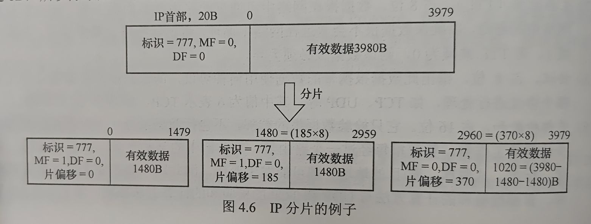
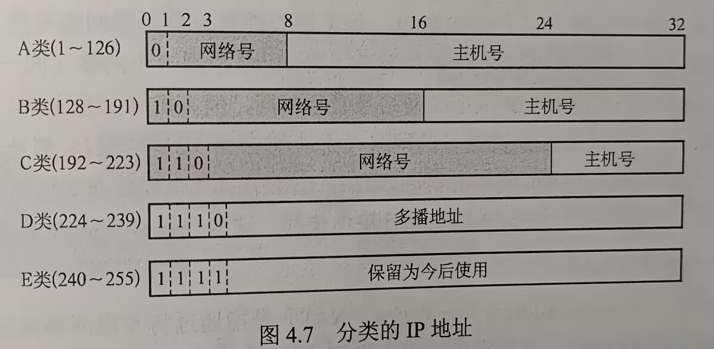

# 第四章 网络层

## 目录
- [第四章 网络层](#第四章-网络层)
  - [目录](#目录)
- [4.1 网络层的功能](#41-网络层的功能)
  - [4.1.1 异构网络互连](#411-异构网络互连)
  - [4.1.2 路由与转发](#412-路由与转发)
  - [4.1.3 网络层提供两种服务](#413-网络层提供两种服务)
    - [虚电路](#虚电路)
    - [数据报](#数据报)
    - [二者比较](#二者比较)
  - [4.1.4 SDN基本概念](#414-sdn基本概念)
    - [基本概念](#基本概念)
    - [SDN接口](#sdn接口)
    - [优点和问题](#优点和问题)
  - [4.1.5 拥塞控制](#415-拥塞控制)
  - [考点\&易错点整理](#考点易错点整理)
- [4.2 IPv4](#42-ipv4)
  - [4.2.1 IPv4分组](#421-ipv4分组)
    - [IPv4分组的格式](#ipv4分组的格式)
    - [IP数据报分片](#ip数据报分片)
  - [4.2.2 IPv4地址与NAT](#422-ipv4地址与nat)
    - [IPv4地址](#ipv4地址)
    - [网络地址转换（NAT）](#网络地址转换nat)
  - [4.2.3 划分子网与路由聚合](#423-划分子网与路由聚合)
    - [划分子网](#划分子网)
    - [子网掩码](#子网掩码)
    - [无分类编制CIDR](#无分类编制cidr)
    - [路由聚合](#路由聚合)
    - [子网划分举例](#子网划分举例)
  - [4.2.4 网络层转发分组的过程](#424-网络层转发分组的过程)
  - [4.2.5 地址解析协议](#425-地址解析协议)
    - [IP地址与硬件地址](#ip地址与硬件地址)
    - [地址解析协议](#地址解析协议)
  - [4.2.6 动态主机配置协议DHCP](#426-动态主机配置协议dhcp)
    - [含义](#含义)
    - [DHCP原理及交换过程](#dhcp原理及交换过程)
    - [重要概念](#重要概念)
  - [4.2.7 网际控制报文协议ICMP](#427-网际控制报文协议icmp)

# 4.1 网络层的功能

- 网络层提供主机到主机的通信服务，主要任务：将分组从源主机经过多个网络、多段链路传输到目的主机
  - 分组转发
  - 路由选择
- TCP/IP体系结构中，网络层只提供简单灵活的、无连接的、尽最大努力交付的**数据报服务**
  - 传送的分组可能出错、丢失、重复、失序、超时 —— 路由器可以做得很简单，价格低廉
  - 通信可靠性由更高层传输层负责
  - 优点：网络造价大幅降低，运行方式灵活，能适应多种应用

## 4.1.1 异构网络互连

- **互联网**是全球范围内数以百万计的**异构网络**互连起来的 ——由网络层实现这种互联

  - 异构：网络的拓扑结构、寻址方案、差错处理方法、路由选择机制都不尽相同

- **网络互联**：两个以上的计算机网络，通过一定方法，用一些**中继系统**相互连接起来，构成更大网络系统

  - 根据所在层次，中继系统分为4种
    1. 物理层中继系统：转发器、集线器
    2. 数据链路层中继系统：网桥/交换机
    3. 网络层中继系统：路由器
    4. 网络层以上中继系统：网关
  - 网络互联通常指使用**路由器**进行**网络连接和路由选择**
    - 因为使用物理层、数据链路层中继系统连接，只是把网络扩大了，它们在网络层观点仍是同一网络

- TCP/IP在网络互连方面在网络层采用标准化协议，相互连接的网络可以是异构的

  

  - 参与互连的计算机使用**相同的IP**，通过IP可以使性能各异的网络在网络层上看起来像一个**统一**的网络
  - 可以把互联后的网络视为一个 *虚拟互联网络*，简称IP网络

- 使用IP网：IP网上的主机进行通信时，就好像在单个网络上通信一样，看不见互连的各个网络的具体异构细节（如具体编址方案、路由选择协议等）

## 4.1.2 路由与转发

- **路由选择**：根据路由协议构造**路由表**，同时经常或定期地与相邻路由器交换信息，获取网络最新拓扑，*动态更新维护路由表*，以决定分组到达目的地节点最优路径
- **分组转发**：路由器根据**转发表**将分组从合适的端口转发出去
  - 转发表查询、转发及相关的队列管理任务调度
- 路由表vs转发表
  - 路由表，根据路由算法得出；转发表，从路由表得出
  - 路由表最优化网络拓扑变化的计算；转发表结构应使查找过程最优化
  - 讨论**路由选择原理**时，通常不区分转发表、路由表，统一使用路由表

## 4.1.3 网络层提供两种服务

- **分组交换**网根据通信子网向端点系统提供的服务可分为两种（这两种服务由网络层提供）
  - 面向连接的虚电路服务
  - 无连接的数据报服务
- 补充：对分组交换网的理解
  - 采用分组交换的网络整体 —— 将数据切成分组，通过存储-转发方式在网络中传递
  - **涉及多层**，包括物理层、数据链路层、网络层etc.

### 虚电路

- 虚电路方式中，两台计算机进行通信，应先建立网络层的连接，即建立一条逻辑上的虚电路；连接建立即**固定**虚电路对应的**物理路径**
- 通信过程分为三个阶段
  - 虚电路建立
    - 每次建立时，将一个未用过的**虚电路号**（VCID）分配给该虚电路
  - 数据传输
    - 双方沿已建立的虚电路传送分组
    - 分组首部**仅在建立连接时**使用完整的目的地址，之后每个分组首部只需携带这个虚电路编号即可
  - 虚电路释放
- 虚电路网络中，每个节点维持一张虚电路表，表中每项记录一个打开的虚电路信息
  - 包括虚电路号、前一节点和下一节点的标识
- 特点
  - 通信链路的建立和拆除需要时间开销，对交互式应用和少量段分组情况效率低，但是长时间、频繁数据交换效率高
  - 路由选择 体现在连接建立阶段
  - 提供可靠通信功能，保证每个分组正确有序到达
  - 可对两个端点流量控制
  - 致命弱点：当网络中某节点/链路出现故障彻底失效时，所有经过该节点/链路的虚电路将被破坏
  - 分组首部仅包含虚电路号，相对数据报开销小
  - **虚**：电路并非专用，一个节点可能同时有若干虚电路通过

### 数据报

- 网络发送分组前不需先建立连接。源主机高层协议将报文拆成若干较小数据段，并加上地址等控制信息构成分组
- 中间节点**存储**分组很短一段时间，找到最佳路由后尽快**转发**每个分组
- 举例说明发送过程，主机A向B发送
  - 主机A将分组逐个发往与它直接相连的交换节点A，交换节点缓存收到的分组
  - 交换节点查找自己转发表，不同时刻网络状态不同，转发表内容可能不完全相同，**分组交付的节点可能不同**
  - 其他节点收到分组后，类似地转发分组，直到分组到达主机B
- 数据报服务特点
  - 发送分组前无需建立连接，发送方可随时发送分组，网络中节点可随时接收分组
  - 尽最大努力交付，不保证可靠性（分组出错、丢失）；网络为每个分组独立选择路由，转发路径可能不同，不一定按序到达目的节点
  - 发送分组要包括发送方、接收方完整地址
  - 分组在交换节点存储转发，有时需要排队等候处理，排队时延；会在拥塞时大大增加，交换节点可丢弃部分分组
  - 网络具有冗余路径，故障适应能力较强
  - 收发双方不独占链路，资源利用率较高

### 二者比较

|                    | 数据报服务                                             | 虚电路服务                             |
| ------------------ | ------------------------------------------------------ | -------------------------------------- |
| 连接建立           | 不需                                                   | 需要                                   |
| 目的地址           | 每个分组都有完整目的地址                               | 仅建立连接阶段使用，后续使用VCID       |
| 路由选择           | 每个分组独立路由转发                                   | 同一虚电路的分组按同一路由转发         |
| 分组顺序           | 不保证有序                                             | 有序                                   |
| 可靠性             | 不保证可靠通信，可靠得由用户主机保证                   | 可靠                                   |
| 对网络故障适应     | 出故障节点丢失分组，其他分组路径发生变化时可以正常传输 | 所有经过故障节点的虚电路均不能正常工作 |
| 差错处理、流量控制 | 用户主机流量控制，不保证数据报可靠性                   | 由分组交换网负责，也可由用户主机负责   |

## 4.1.4 SDN基本概念

### 基本概念

- 网络层可抽象地划分为
  - 数据平面（也称转发层面） —— 转发
  - 控制平面 —— 路由选择
- 软件定义网络（Software Defined Network，SDN）是近年流行的一种创新网络架构，采用**集中式的控制平面**和**分布式的数据平面**，两个平面互相分离
  - 控制平面利用*控制-数据接口*对数据平面上路由器进行集中式控制
- SDN结构中，路由器不需要路由选择软件了，路由器也不再相互交换路由信息
  - 控制平面有一个*逻辑上*的**远程控制器**（可由多个服务器组成）
    - 远程控制器：掌握各主机和整个网络状态，为每个分组计算最佳路由；通过Openflow协议（或其他途径）将转发表（SDN中称**流表**）下发给路由器
  - 路由器工作
    - 收到分组
    - 查找转发表
    - 转发分组
  - 这样网络又变成集中控制的，而互联网本来是分布式的
  - 大型数据中心之间的广域网，使用SDN模式建造可以使网络运行效率更高

### SDN接口

- SDN的可编程性，为开发者提供了强大的编程接口
  - 北向接口：SDN提供的编程结构，开发者可以设计自己的应用
  - 南向接口：SDN控制器和转发设备建立双向会话的接口
    - 通过不同的南向接口协议（如Openflow），SDN控制器可以兼容不同的硬件设备，并能在设备中实现上层应用的逻辑
  - 东西向接口：SDN控制器集群内部控制器**之间**的通信接口
    - 用于增强整个控制平面的可靠性可拓展性

### 优点和问题

- 优点
  - 全局集中式控制和分布式高速转发，既利于控制平面的全局优化，又利于高性能的网络转发
  - 灵活可编程与性能的平衡，控制和转发功能分离后，网络可以由专有的自动化工具以编程方式配置
  - 降低成本，实现网络设备制造与功能软件的开发香相分离
- 问题
  - 易受攻击，崩溃则整个网络都会收到影响
  - 瓶颈问题，控制器可能称为网络性能的瓶颈

## 4.1.5 拥塞控制

- 拥塞：因过量的分组而引起网络性能的下降
- 判断方法：观察网络吞吐量与网络负载关系
  - 若随负载增加，网络吞吐量明显小于正常吞吐量，则网络可能已进入轻度拥塞状态
  - 若吞吐量随网络负载增大而减少，则网络可能已进入拥塞状态
- **拥塞控制**：主要解决如何获取网络中发生拥塞的信息，从而利用这些信息控制网络，以避免因拥塞造成的分组丢失
  - 作用：确保网络能承载所达到的流量，是*全局性*的过程
- 拥塞控制vs流量控制
  - 流量控制往往指发送方、接收方间点对点通信量的控制，它要做的是抑制发送方发送速率
- 拥塞控制两种方法
  - **开环控制**，设计网络是，事先考虑有关发生拥塞的因素。**静态的预防方法**，启动后不需再修改
  - 闭环控制，事先不考虑拥塞的因素，采用监测网络监视，及时检测哪里发生拥塞，将拥塞信息传到合适地方调整网络系统的运行，**动态的方法**

## 考点&易错点整理

- 路由器互连的多个局域网结构中，要求每个局域网 物理层、数据链路层、**网络层**协议可以不同，而以上高层协议必须相同
  - 路由器是网络层设备，向传输层及以上隐藏下层的具体实现，物、链、网实现都被隐藏，所以可以不同
  - **网络层**不同举例：使用特定路由器连接IPv4和IPv6
- 存储转发机制：先**接收整个**分组，对分组进行错误检查，正确则转发，错误即丢弃
- 虚电路建立连接时建立的是逻辑连接（并非物理连接）
  - 注意虚电路连接需要主动断开，而不是会话结束就释放连接

# 4.2 IPv4

## 4.2.1 IPv4分组

- IPv4（版本4）：现在普遍使用的**网际协议**（Internet Protocal，IP）
  - 定义数据传送的基本单元 —— IP分组及其确切数据格式
  - 包括一套规则，指明分组如何处理、错误怎样控制

### IPv4分组的格式

- 由首部和数据部分组成，首部分两部分，前一部分长度固定，共20B（所有IP分组必须具有的）；后面是一些可选字段，长度可变，提供错误检测和安全等机制

- 首部重要字段含义

  1. 版本，4bit。
     - 指IP版本，IPv4中值为4

  2. 首部长度，4bit。

     - 以4B为单位，例如不使用任何可选字段的首部长度20B，该值为5

     - 最大首部长度是60B，达到最大值15（1111B)

  3. 总长度，16bit。

     - 1B为单位，数据报最大长度为$2^{16}-1=65535B$

     - 而以太网帧最大传送单元（MTU）为1500B

     - IP数据报封装成帧时，总长度一定不能超过下面数据链路层的MTU

  4. **标识**，16bit

     - 计数器，每产生一个数据报就+1，并赋值给标识字段
     - **原始数据报的标识号唯一**，所以组装时能分辨出来
     - 分片时，每个数据报片都复制一次**标识号**，以便能正确重装

  5. 标志（Flag），3bit。

     - 最低位MF，MF = 1表示后面还有分片，MF = 0表示最后一个分片

     - 标志字段中间位位DF，只有DF = 0才允许分片

  6. 片偏移，13bit。

     - 较长数据报在分片后，该片在原数据报中相对位置

     - 8B位单位 -> 除最后一个分片外，每个分片长度**必定**是8B的整数倍

  7. 生存时间（TTL），8bit

     - 可通过路由器数最大值，标识数据报在网络中寿命（确保不会永远在网络中循环）

     - 路由器转发前，TTL减一。若减到0了就不转发丢弃了

  8. 协议，8bit

     - 数据部分上交给哪个协议进行处理

     - 值6 TCP；17 UDP

  9. 首部检验和（checksum），16bit

     - 源地址字段，4B

  10. 发送方**IP地址**

  11. 目的地址字段，4B

### IP数据报分片

- 链路层数据帧能承载最大数据量为 **最大传送单元**（MTU）
  - 以太网MTU = 1500B；许多广域网MTU <= 576B
- MTU严格限制IP数据报的长度 -> 较长IP数据报分装成较小IP数据报，称为**片**
  - 片在目的地网络层会重新组装
  - 目的主机使用IP首部中：标识、标志和片偏移字段完成对片的重组

- 分片&重组中字段分析

  - 分片时，形成的每个数据报（片）都具有原始数据的标识号
  - 目的主机收到来自同一发送主机一批数据报时
    - 可以通过**检查数据报标识号**来确定数据片属于哪些原始数据报
    - 重组时，使用片偏移字段来确定片应放原始IP数据报的哪个位置
  - 标志位只有后两位有意义
    - DF（Don't Fragment）
    - MF（More Fragment）

- 分片计算示例

  

## 4.2.2 IPv4地址与NAT

### IPv4地址

- IP地址：是给连接到互联网上每台主机（或路由器）的每个接口，全球范围内**唯一**的32bit标识符
  - 由 ICANN（互联网名字和数字分配机构）进行分配
  - 32位IP地址分为4段，每段8位，用等效十进制标识，每段中加一个小数点 —— **点分十进制记法**

- `IP地址 ::= {<网络号>，<主机号>}`

  - **网络号**标志主机（或路由器）所连接到的**网络**，网络号在整个互联网范围内必须是唯一的
  - **主机号**标志该**主机**（或路由器），主机号在网络号指明的**网络范围内唯一**
  - 由此，一个IP地址在整个互联网范围内都是唯一的
  - 

- IP地址中部分有特殊用途，不作主机的IP地址：

  - 主机号全为0，表示网络本身，202.98.174.0
  - 主机号全为1，广播地址（也称直接广播地址），202.98.174.255
  - 127.x.x.x，保留作为**本地**软件**环回测试**（Loopback Test）本主机进程之间通信用，目的地址为环回地址的IP数据报不会被主机发送到任何网络
  - 32位全0，0.0.0.0，本网络上本主机
  - 32位全1，255.255.255.255，**受限广播地址**，仅在本网络上进行广播

- 常用三类IP地址使用范围  

  | 网络类别 | 最大可用网络数 | 第一个可用网络号 | 最后一个可用网络号 | 每个网络中最大主机数 |
  | :------: | -------------- | ---------------- | ------------------ | -------------------- |
  |    A     | $2^7 - 2$      | 1                | 126                | $2^{24}-2$           |
  |    B     | $2^{14}$       | 128.0            | 191.255            | $2^{16}-2$           |
  |    C     | $2^{21}$       | 192.0.0          | 223.255.255        | $2^8-2$              |

  - A类地址可用网路数$2^7-2$，-2原因为
    - **网络号字段全0的IP地址是保留地址**，本网络
    - 网络号127的IP地址是环回自检地址
  - 每个网络中最大主机数-2原因：全0和全1的主机号不指派
    - 分别用作网络本身和广播地址

- IP地址重要特点

  - IP地址由网络号和主机号两部分组成，IP地址是分等级的地址结构，好处如下
    - IP地址管理机构分配IP地址时只分配网络号，主机由得到网络的单位自行分配，方便IP地址管理
    - 路由器仅需根据目的主机所连接的网络号转发分组，减小了路由表存储空间
    - 转发器、桥接器（网桥等）连接的若干LAN仍然是同一个网络（同一个广播域），因此该LAN中所有主机IP地址的 网络号必须相同，主机号必须不相同
    - IP地址中，所有分配到网络号的网络（无论是LAN还是WAN），都是平等的
    - **同一个局域网**上的主机或路由器接口的IP地址中**网络号必须相同**

### 网络地址转换（NAT）

- 网络地址转换（Network Address Translation，NAT）：专用网络地址（如Intranet） -> 公用地址（如Internet），从而对外隐藏内部管理的IP地址
  - 整个专用网只需一个全球IP地址就可与互联网连通，大大节省IP地址的消耗
  - 隐藏内部网络结构，从而降低内部网络受攻击的风险

- 为了网络安全，划出三个**私有**IP地址块，只用于LAN，而不用于WAN（因此**私有IP地址不能直接用于互联网**，需通过NAT转换成合法全球IP地址才能出现于互联网上）
  - **10**.0.0.0/8（即**10**.0.0.0 ~ **10**.255.255.255），相当于一个A类网络
  - **172.16.**0.0/12（即**172.16**.0.0 ~ **172.31**.255.255），相当于16个连续的B类网络
  - **192.168.0**.0/16（即**192.168.0**.0 ~ **192.168.255**.255），相当于256个连续的C类网络
- 采用私有IP地址的互联网络称为**专用互联网**或**本地互联网**
  - 私有IP地址也称为**可重用地址**
- 使用NAT，需要在专用网连接到互联网的路由器上安装NAT软件
  - NAT路由器至少有一个有效的外部全球IP地址
  - 使用NAT转换表进行本地IP地址 -> 全球IP地址的转换
    - 表项：{本地IP地址：端口} -> {全球IP地址：端口}的映射
  - 可以多个私有IP地址映射到一个全球IP地址
- NAT原理和应用
  - 某家庭办理一个宽带获得全球IP地址136.76.29.7，家庭网络内3台主机使用私有地址（10.0.0.0网段），家庭网关路由器应开启NAT功能
  - 工作原理
    - 用户主机10.0.0.1（随机端口3345）向web服务器128.119.40.186（端口80）发送请求
    - NAT路由器收到IP分区，为该IP生成一个新端口号5001，IP分组源地址改为136.76.29.7，源端口号改为5001
    - NAT路由器在NAT转换表中增加一个表项
    - Web响应的IP地址为改装后端IP地址，向其发送响应
    - 响应分组到达NAT路由器后，通过NAT转换表将IP分组目的IP地址改为10.0.0.1，目的端口号改为3345
- 普通路由器 v.s. NAT路由器
  - 普通路由器仅工作在网络层
  - NAT路由器转发数据报时需要查看和转换**传输层的端口号**
- 内网映射到公网（如私网中部署的Web服务器、FTP服务器等）
  - 可在NAT表中配置“公网IP地址+端口号” -> "私网IP地址 + 端口号"的映射关系

## 4.2.3 划分子网与路由聚合

### 划分子网

- 两级IP地址缺点：
  - IP地址空间利用率有时很低
  - 每个物理网络分配一个网络号会使路由表变得太大，进而网络性能变坏
  - 两级IP地址不够灵活
- IP地址中增加 “子网号字段”，变为三级IP地址，这种做法称为**划分子网**（已称为标准协议

- 划分子网基本思路
  - 仅是单位内部的事。单位对外表现为未划分子网的一个网络
  - 划分子网方法：从主机号借用若干位为子网号，主机号也相应减少相同位数
  - 三级IP地址结构 `IP地址 ::= {<网络号>，<子网号>，<主机号>}`
  - 路由器转发分组根据仍是IP数据报目的网络号，本单位路由器收到IP数据报后，按目的网络号和子网号找到目的子网，最后将IP数据报交付给目的主机
- 举例：C类网络208.115.21.0划分4个子网，则子网号需要占用2bit，因此主机号只有6位
  - 子网网络地址分别为208.115.21.0, 208.115.21.64, 208.115.21.128, 208.115.21.196
  - 每个子网可分配IP数为$2^6-2=62$
- 注意
  - 划分子网并不会改变IP地址原有网络号
  - **子网的主机号**（指划分后剩下的主机号）不能被指派，全0用作子网网络地址，全1用作广播地址
  - 划分子网增加灵活性，但减少可用IP地址

### 子网掩码

- **子网掩码**：与IP地址相对应的、长32位的二进制串，由一串1和跟随的一串0组成
  - 1对应IP地址中网络号、子网号；0对应主机号
  - `子网网络地址 = IP地址 ^ 子网掩码`
- **默认网关**：子网与外部网络连接的设备，即连接本机或子网的 **路由器接口的IP地址**
- 现代互联网标准规定：所有网络都必须使用子网掩码。若一个网络未划分子网，那么它使用**默认子网掩码**
  - A类默认子网掩码255.0.0.0
  - B类255.255.0.0
  - C类255.255.255.0
- 路由器相互之间交换路由信息时，必须将自己所在网络的子网掩码告诉对方
  - 分组转发时，路由器将分组目标地址和某网络的（*测测它是不是要发的*）子网掩码按位相与，若结果与该网络地址一致，则路由匹配成功，路由器将分组转发至该网络
- 使用子网掩码
  - 一台主机在设置IP地址信息同时，必须设置子网掩码
  - 同属于**一个子网**所有主机及路由器的相应端口，必须设置**相同的子网掩码**
  - 路由器路由表中包含的信息主要内容由
    - 目的地址、子网掩码、下一跳地址

### 无分类编制CIDR

- 无分类域间路由选择（Classless Inter-Domain Routing, CIDR）是在变长子网掩码的基础上，提出的一种消除传统ABC类地址及划分子网的概念

- CIDR使用**网络前缀**的概念代替网络的概念，与传统分类IP地址最大的区别就是，网络前缀的位数**不是固定的**

- 记法`IP地址 ::= {<网络前缀>, <主机号>}`

- CIDR还使用斜线记法（CIDR记法），记为`IP地址/网络前缀所占的位数`

  - 采用CIDR后，斜线及后面的数字一定不能省略
  - 例如128.14.32.5/20这个，它的掩码是20个连续的1和12个连续的0

  - 逐位”与“
    - IP     =   <u>10000000.00001110.0010</u>0000.00000101
    - 掩码 =   <u>11111111.11111111.1111</u>0000.00000000
  - 网络前缀 =   <u>10000000.00001110.0010</u>0000.00000000（128.14.32.0）

- CIDR将**网络前缀都相同**的连续IP地址组成**CIDR地址块**，只需知道CIDR地址块中的任何一个地址，就能知道这个地址块的最大地址、最小地址及地址块中地址数

  - 128.14.32.5/20
    - 最小地址: <u>10000000.00001110.0010</u>0000.00000000（128.14.32.0）
    - 最大地址: <u>10000000.00001110.0010</u>1111.11111111（128.14.47.255）
  - 这俩地址通常不使用，通常只使用在这两个特殊地址之间的地址

- CIDR虽然不使用子网，但仍使用”掩码“一词

  - 不使用子网：指CIDR并没有指明若干位作为子网字段
  - 但分配到一个CIDR地址**块**的单位，仍可在本单位根据需要划分出一些子网
  - 某单位分配到地址块/20，就**可**继续划分8个子网，向主机号借用3位划分子网（也可划分更多/更少子网），这时每个子网的网络前缀就变成了23位

- CIDR地址块中地址数一定是**2的整数次幂**

  - 实际可指派的地址数通常为$2^{N}-2$
    - N表示主机号的位数；主机号全0代表网络号，主机号全1为广播地址
  - 网络前缀越短，地址块包含的地址数越多
  - 在三级结构的IP地址中，划分子网使网络前缀变长

### 路由聚合

- **路由聚合**：路由表中就可利用较大的一个CIDR地址代替许多较小的地址块
  - 路由表中的一个项目可以表示原来传统分类地址的多条路由项目
  - 压缩路由表所占的空间，从而提高了网络性能
- 考虑网络1：206.1.0.0/17；网络2：206.1.128.0/17都在路由器R2下，下一跳发给R2
  - 前16位都是相同，第17位分别是0和1
  - 且两个网络下一条皆为R2
  - 若使用**路由聚合**，网络1和网络2可以构成一个更大的地址块206.1.0.0/16，二者可以聚合成一条到206.1.0.0/16的路由
- **最长前缀匹配**（最佳匹配）：
  - CIDR时，路由表中表项由 （网络前缀，下一跳）
  - 应当从匹配结果中**选择具有最长网络前缀的路由**
    - 因为网络前缀越长，其地址块越小，路由越具体
- CIDR查找路由表的方法：
  - 通常将无分类编址的路由表存放在一种层次式数据结构（通常**二叉线索**）
  - 然后自上而下按层次进行查找
- 优点
  - 在于网络前缀长度灵活性
    - 上层网络的前缀长度较短，所以相应的路由表的项目较少
    - 内部又可采用演唱网络前缀方法灵活划分子网

### 子网划分举例

- 两类划分子网方法：定长的子网掩码，变长的子网掩码
- 假设CIDR地址块为208.115.21.0/24，划分给3个部门，各部门主机台数50，20，5
- **定长**子网掩码划分子网的应用
  - 3个部门，需要2bit作为子网号
  - 子网可分配IP地址数位$2^{8-2}-2=62$，能够满足各部门的需求
    - 208.115.21.0/26，分给部门1
    - 208.115.21.64/26，分给部门2
    - 208.115.21.128/26，分给部门3
    - 208.115.21.192/26，留作以后用
- 变长子网掩码划分子网
  - 计算需要主机号位数注意 n 位子网提供$2^n-2$个可分配地址
  - 部门1需要6位主机号，余26位作为网络前缀
    - 如果部门1有63台主机，那么它可能会要7位主机号
  - 部门2主机号5位，余27位网络前缀
  - 部门3主机号3位，余29位网络前缀
  - **每个子网最小地址只能选择主机号全0的地址**
- 子网主机号全0或全1的地址通常不分配，对于一段连接**两个路由器**的链路，可以分配**/30**的地址块，这样可分配地址为2个，恰好可分配给链路两端路由器接口
  - **最新标准**：直线连线的两个路由器接口可不分配IP地址；若分配IP地址，则这一段连接就构成一种只包含一段点对点的特殊”网络“（网络只有两个地址，分给两端点对点），这种网络仅需两个IP地址，主机号可以是0或1，可以使用**/31**地址块

## 4.2.4 网络层转发分组的过程

- 转发表中，每条路由必须有 （目的网络地址，下一跳地址）
  - 分组到达路由器后，路由器根据目的IP地址的网络前缀查找转发表，确定下一跳到哪个路由器
  - 可能多次间接交付
  - 直接交付 —— 到达最后一个路由器时，向目的主机直接交付
- 采用CIDR编址时，使用最长前缀匹配
  - 为了更快查找转发表，转发表按前缀长度降序排列
- 两种特殊路由
  - **特定主机路由**：对特定目的主机的IP地址专门指明一个路由，方便网络管理员控制、测试网络
    - e.g. 特定主机IP为a.b.c.d，转发表中对应项的目的网络a.b.c.d/32，/32表示子网掩码无意义，但是它**可以用在转发表中**
  - **默认路由**：特殊前缀0.0.0.0/0表示默认路由，任何目的地址都可以匹配上
    - **通常用于路由器到互联网的路由**，只要目的地是其他网络，一律选择默认路由
- 路由器执行**分组转发**算法如下：
  1. 收到IP分组提取目的主机IP地址 **D**（目的地址）
  2. 先查*特定主机路由*，查到则按这条路由下一跳转发分组；否则进入步骤3开始最长前缀匹配
  3. 这一行子网掩码于目的地址D逐位与操作，若结果与本行前缀匹配，则查找结束，按下一跳指出的进行处理；否则 若转发表还有下一行，则对下一行检查，重新执行步骤3，若无则步骤4
  4. 若转发表**有**默认路由，则传送给默认路由；若无则报告转发分组出错
- 得到下一跳路由器IP地址后，不是直接将该地址填入待发送数据报，而是**将IP地址通过ARP转换为MAC地址**，将此MAC地址填入MAC帧首部，根据这个MAC地址找到下一跳路由器

## 4.2.5 地址解析协议

### IP地址与硬件地址

- 基本概念

  - IP地址：网络层、网络层之上使用的地址，分层式 —— 分出网络号、子网号、主机号

  - 硬件地址（MAC地址）是数据链路层使用的地址，平面式 —— 6B的MAC地址

  - IP地址放在IP数据报首部，MAC地址放在MAC帧的首部；IP数据报封装为MAC帧后，数据链路层看不到IP数据报中的IP地址

- IP数据报经过多次路由转发（这里以IP地址寻址）到目标网络后，改为在目标局域网中通过数据链路层的MAC地址以广播方式寻址

- 计算机网络的精髓

  - **IP层抽象**的互联网上只能看到IP数据报 —— 底下的都是透明的
  - 虽然IP数据报中有源地址，但是路由器**仅根据目的IP地址进行转发**
  - 局域网的链路层只能看见MAC帧。IP数据报封装在MAC帧中，通过路由器转发时，IP数据报在每个网络中都被路由器解封装、重新封装，其**MAC帧首部中源地址和目的地址会不断改变** -> 无法使用MAC地址跨网络通信
  - IP层抽象的互联网屏蔽了下层复杂的网络细节，只要在网络层之上讨论问题，就能使用统一的、抽象的IP地址研究主机或路由器之间的通信

- 路由器互连多个网络，它不仅有多个IP地址、还有多个硬件地址

### 地址解析协议

- **地址解析协议**（ARP）
  - 每台主机设有一个**ARP高速缓存**，存放本局域网上各主机和路由器的 **IP地址到MAC地址** 的映射表，称为ARP表
    - 每个表项都设置生存实际，超时删除
- ARP工作原理：
  - 主机A欲向本局域网上某台主机B发送IP数据报时，先在A上ARP高速缓存查找
  - 若有，则查出硬件地址，将此硬件地址写入MAC帧，通过局域网发送给此硬件地址
  - 若没有，使用目的MAC地址为FF-FF-FF-FF-FF-FF的帧**广播**ARP请求分组
  - 局域网中每个主机都会收到帧，若帧包含的目的IP地址与本机相同（此处为主机B），则向源主机（主机A）发送**响应分组**（**单播**发送），响应分组包含B的IP与它MAC地址映射关系
  - 主机A收到响应分组，将此映射写入ARP缓存，并按查询到的硬件地址发送MAC帧

- 使用ARP的四种典型情况
  - 发送方是主机H1，IP发送到本网络另一台主机H1。H1在本网络用ARP找到H2硬件地址
  - 发送方是主机H1，需要发送到其他网络另一台主机H4。H1用ARP找到与网1相连的路由器R1的硬件地址（其他网络使用**默认网关**），剩下工作交给R1完成
  - 发送方是路由器R1，需要发送到R1相连的网络2的另一台主机H3。R1在网络中用ARP找到H3硬件地址
  - 发送方是路由器R1，需要发送到其他网络3另一台主机H4。R1在网络2用ARP找到与网2相连的路由器R2的硬件地址，剩下工作交给R2完成

## 4.2.6 动态主机配置协议DHCP

### 含义

- **动态主机配置协议**（Dynamic Host Configuration Protocol，DHCP）常用于给主机动态分配IP地址，提供即插即用的联网机制，允许计算机加入新的网络**自动获取IP地址**而不用手工参与
- **DHCP是应用层协议**，基于UDP
- DHCP使用客户/服务器模型
- 连接到互联网的计算机需要配置如下
  - IP地址
  - 子网掩码
  - 默认路由器的IP地址（默认网关）
  - 域名服务器的IP地址

### DHCP原理及交换过程

- 原理

  - 需要IP地址的主机在启动时向DHCP服务器**广播**发送**发现报文**，此时主机称为**DHCP客户**

  - 本地网络上所有主机都能收到，但只有**DHCP服务器**才能回答
    - DHCP先在其数据库中查找该计算机配置信息
      - 若找到，返回配置信息
      - 找不到，在服务器的IP地址池取一个地址分配给该主机

  - DHCP服务器提供的回答报文称为**提供报文**，包含IP地址等配置信息

- 实际过程

  - DHCP客户广播”DHCP发现“消息，意图从DHCP服务器获取IP地址。源地址0.0.0.0，目的地址255.255.255.255
  - DHCP服务器收到消息，**广播**”DHCP提供”消息。源地址DHCP服务器地址，目的地址255.255.255.255
  - DHCP客户收到消息
    - 若接收该IP地址，则广播”DHCP请求“消息，请求DHCP服务器提供IP地址。源地址0.0.0.0，目的地址255.255.255.255
  - DHCP服务器广播“DHCP确认”消息，分配IP地址给DHCP客户。源地址DHCP服务器地址，目的地址255.255.255.255

### 重要概念

- 租用期
- 采用广播方式交互，并采用UDP的原因 —— 二者不知道对方IP地址

## 4.2.7 网际控制报文协议ICMP

- 网际控制报文协议（Internet Control Message Protocol，ICMP），让主机或罗尤其报告差错和异常情况。
  - ICMP报文封装在IP数据报发送
  - 但ICMP是**网络层**协议
- ICMP报文有两种：
  - **ICMP差错报告报文**，用于目标主机或到目标主机路径上路由器，向源主机报告差错和异常情况，有如下5种常用类型
    - 终点不可达
    - 源点抑制
    - 时间超过
    - 参数抑制
    - 改变路由（重定向）
  - **ICMP询问报文**
    - 回答请求和回答报文
    - 时间戳请求和回答报文
- 不应发送ICMP差错报告报文情况
  - 对ICMP差错报告报文，不再发送
  - 对第一个分片的数据片的后续所有数据片，都不发送
  - 对多播地址的数据报，不发送
  - 具有特殊地址（如127.0.0.0，0.0.0.0）的数据报，不发送
- 常见应用
  - **PING**，使用ICMP回送请求和回答报文 —— PING工作在应用层
  - **Traceroute**，使用ICMP时间超过报文

